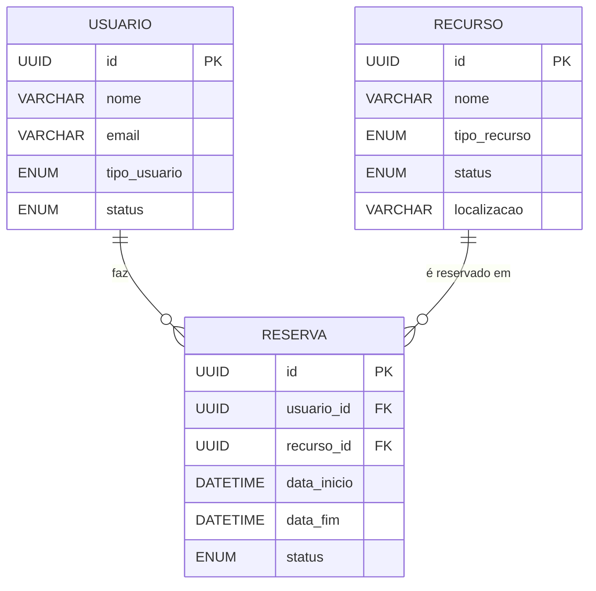
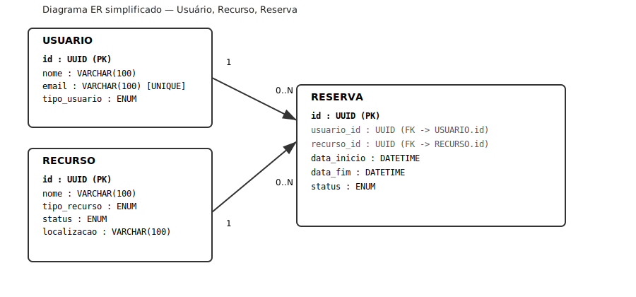

3.1 Modelagem de Entidades

 

1. Usuário (Usuario)

Descrição: Representa qualquer pessoa cadastrada no sistema que possa realizar reservas (alunos, professores, funcionários, etc.)

Atributos:

-id: UUID | Obrigatório | Chave Primária
-nome: VARCHAR(100) | Obrigatório
-email: VARCHAR(100) | Obrigatório | Único
-tipo_usuario: ENUM('ALUNO', 'PROFESSOR', 'ADMIN') | Obrigatório
-status: ENUM('ATIVO', 'SUSPENSO') | Obrigatório | Padrão: 'ATIVO'

2. Recurso (Recurso)

Descrição: Entidade genérica para qualquer item reservável do sistema (um livro da biblioteca, uma sala de reuniões ou um projetor).

Atributos:

-id: UUID | Obrigatório | Chave Primária
-nome: VARCHAR(100) | Obrigatório
-tipo_recurso: ENUM('LIVRO', 'ESPACO', 'EQUIPAMENTO') | Obrigatório
-status: ENUM('DISPONIVEL', 'MANUTENCAO', 'INATIVO') | Obrigatório | Padrão: 'DISPONIVEL'
-localizacao: VARCHAR(100) | Opcional (Relevante para Espaços/Equipamentos)

3. Reserva (Reserva)

Descrição: O vínculo temporal que garante a um usuário o direito de uso de um recurso específico.

Atributos:

-id: UUID | Obrigatório | Chave Primária
-usuario_id: UUID | Obrigatório | Chave Estrangeira (Usuario)
-recurso_id: UUID | Obrigatório | Chave Estrangeira (Recurso)
-data_inicio: DATETIME | Obrigatório
-data_fim: DATETIME | Obrigatório | Deve ser maior que data_inicio
-status: ENUM('SOLICITADA', 'CONFIRMADA', 'EM_USO', 'CONCLUIDA', 'CANCELADA', 'REJEITADA') | Obrigatório | Padrão: 'SOLICITADA'

Relacionamentos e Cardinalidades

Usuario (1) ---- (0..N) Reserva

Justificativa: Um usuário pode realizar nenhuma ou muitas reservas ao longo do tempo. No entanto, uma reserva específica pertence obrigatoriamente a um, e apenas um, usuário.

Recurso (1) ---- (0..N) Reserva

Justificativa: Um recurso pode ser reservado várias vezes (em horários diferentes) ou nunca ter sido reservado. Mas uma reserva específica aponta para um único recurso por vez.

Máquinas de EstadosComo não consigo renderizar um gráfico dinâmico, utilizei a sintaxe textual/Mermaid para desenhar o fluxo de vida das entidades.

Máquina de Estados: Reserva

O fluxo principal envolve a aprovação, o uso real do recurso e a devolução/conclusão.                  [ SOLICITADA ] ──(Rejeitar)──> [ REJEITADA ]

                        │
                  (Confirmar)
                        │
                        ▼
                  [ CONFIRMADA ] ──(Cancelar)──> [ CANCELADA ]
                        │
                  (Iniciar Uso)
                        │
                        ▼
                   [ EM_USO ]
                        │
                  (Finalizar)
                        │
                        ▼
                  [ CONCLUIDA ]

Máquina de Estados: RecursoControla a disponibilidade operacional do item.      

       ┌──(Colocar em Manutenção)──┐
       ▼                           │
[ DISPONIVEL ] ◄──(Concluir Man.)──┴─> [ MANUTENCAO ]
       │                                     │
   (Inativar)                            (Inativar)
       │                                     │
       └───────────────► [ INATIVO ] ◄───────┘

3.2 Regras de Negócio

Aqui estão as 5 regras de negócio cruciais para blindar o comportamento do sistema.

RN-001: Bloqueio de Sobrepoosição de Horário

-Identificador: RN-001
-Nome: Reserva não pode sobrepor horário de um mesmo recurso
-Gatilho: Ao criar ou atualizar uma reserva.
-Pré-condição: O recurso deve estar com o status DISPONIVEL.
-Ação: O sistema deve verificar se já existe alguma reserva para o mesmo recurso_id cujos intervalos de tempo (data_inicio e data_fim) interceptem o período solicitado. A checagem lógica é: 

NOVAinício < EXISTENTEfim AND NOVAfim > EXISTENTEinício

e onde o status da reserva existente seja diferente de CANCELADA ou REJEITADA.

Violação: 
     * HTTP: 409 Conflict
     Payload:

     {
     "error": "CONFLITO_HORARIO",
     "message": "O recurso escolhido já está reservado para o período solicitado."
     }

RN-002: Usuários Suspensos Não Reservam

-Identificador: RN-002
-Nome: Impedir reservas de usuários suspensos
-Gatilho: Ao tentar criar uma nova reserva.
-Pré-condição: Nenhuma (validação inicial).
-Ação: O sistema deve consultar o status do Usuario requisitante. Se o status for igual a SUSPENSO, a operação é imediatamente abortada.

-Violação:

     HTTP: 403 Forbidden
     Payload:
    
     {
     "error": "USUARIO_SUSPENSO",
     "message": "Sua conta possui pendências ou suspensões ativas. Novas reservas não são permitidas."
     }

RN-003: Prazo Limite para Cancelamento

-Identificador: RN-003
-Nome: Cancelamento com antecedência mínima de 1 hora
-Gatilho: Ao solicitar o cancelamento de uma reserva.
-Pré-condição: A reserva deve estar com o status CONFIRMADA.
-Ação: O sistema calcula a diferença entre o horário atual ($\text{Agora}$) e a data_inicio da reserva. Se a diferença for menor que 60 minutos, o cancelamento é impedido.

-Violação:

     HTTP: 422 Unprocessable Entity
     Payload:
     {
     "error": "PRAZO_CANCELAMENTO_EXPIRADO",
     "message": "Reservas só podem ser canceladas com antecedência mínima de 1 hora do início planejado."
     }

RN-004: Limite de Reservas Simultâneas por Aluno

-Identificador: RN-004
-Nome: Limite máximo de reservas ativas para o tipo Aluno
-Gatilho: Ao criar uma nova reserva.
-Pré-condição: O tipo_usuario do requisitante deve ser ALUNO.
-Ação: O sistema conta quantas reservas do mesmo usuario_id possuem o status SOLICITADA, CONFIRMADA ou EM_USO. Se o total for igual ou superior a 3, a nova reserva é negada (Garante que um único aluno não monopolize os espaços).

-Violação:

     HTTP: 422 Unprocessable Entity
     Payload:
     {
     "error": "LIMITE_RESERVAS_EXCEDIDO",
     "message": "Usuários do tipo ALUNO só podem possuir até 3 reservas ativas simultaneamente."
     }

RN-005: Recurso em Manutenção Não Pode Ser Reservado

-Identificador: RN-005
-Nome: Bloqueio de reservas para recursos indisponíveis
-Gatilho: Ao criar uma nova reserva.
-Pré-condição: Nenhuma.
-Ação: O sistema consulta a tabela de Recurso para o ID solicitado. Se o status atual do recurso for MANUTENCAO ou INATIVO, o sistema impede o agendamento, mesmo que não haja outras reservas no período.

-Violação:

     HTTP: 400 Bad Request
     Payload:
     {
     "error": "RECURSO_INDISPONIVEL",
     "message": "O recurso solicitado encontra-se em manutenção ou foi desativado pelo administrador."
     }